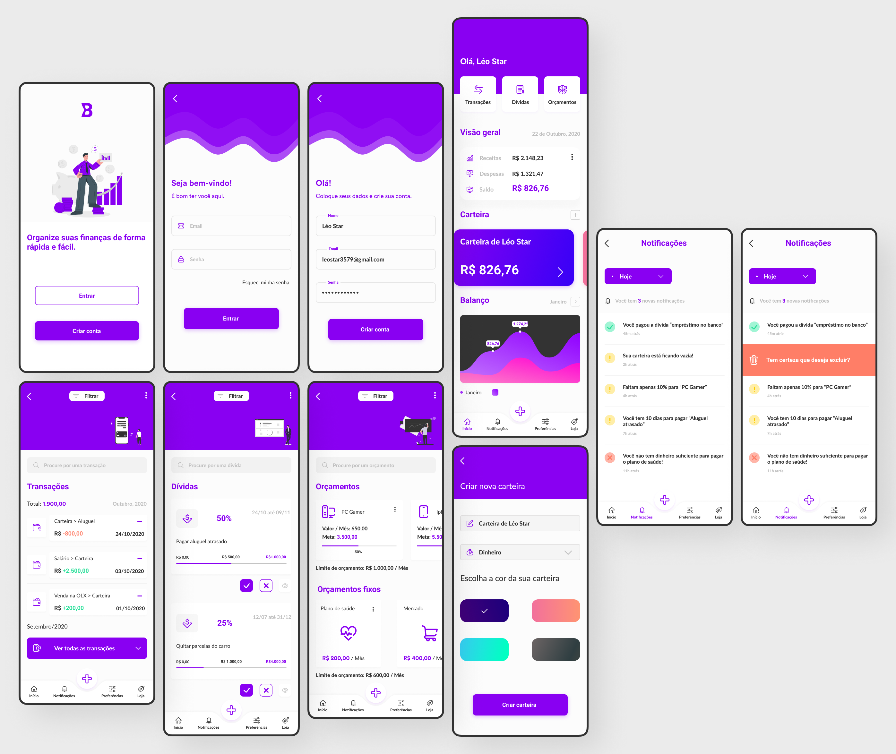

<h1 align="center">:moneybag: Bits</h1>

<h2 align="center">
  Aplicativo de controle de gastos e finanças pessoais.
</h2>

<p align="center">
	<a href="./LICENSE">
		</img>
	</a>
	</img>
</p>

<br />

<h3 align="center">App showcase</h3>

<p align="center">
	</img>
</p>

## :page_facing_up: Índice

- [Sobre](#about)
- [Primeiros passos](#getting_started)
- [Tecnologias usadas](#built_using)

## 🧐 Sobre <a name = "about"></a>

Aplicativo para controle de gastos, desenvolvido com React Native.

## 🏁 Primeiros passos <a name = "getting_started"></a>

Estas instruçōes te darão uma cópia funcional do projeto na sua máquina local para desenvolvimento e testes.

### Instalando as dependências:
```sh
yarn
```

### Rodando a aplicação:
```sh
yarn start
```

## :computer: Tecnologias usadas <a name="built_using">

* [Expo](https://expo.io/)
* [React Native](https://reactnative.dev/) - Desenvolvimento híbrido de aplicações nativas
* [React Navigation](https://reactnavigation.org/) - Biblioteca de navegação
* [React-native-toast-message](https://github.com/calintamas/react-native-toast-message) - API imperativa de mensagens Toast
* [React-native-svg-charts](https://github.com/JesperLekland/react-native-svg-charts) - Biblioteca de gráficos
* [React-native-async-storage](https://github.com/react-native-async-storage/async-storage) - Armazenamento assíncrono de chave-valor no React Native
* [Axios](https://axios-http.com/) - cliente HTTP baseado em Promises
* [KnexJS](https://knexjs.org/) - SQL Query Builder
* [PostgreSQL](https://www.postgresql.org/) - Banco de dados relacional
* [Docker](https://docs.docker.com/get-started/overview/)
* [Docker-compose](https://docs.docker.com/compose/)
* [Date-fns](https://date-fns.org/) - Toolset para manipulação de datas e i18n de datas
* [Styled-components](https://styled-components.com/) - Css in js library
* [Eslint](https://eslint.org/) - JavaScript linter
* [Prettier](https://prettier.io/) - Code formatter